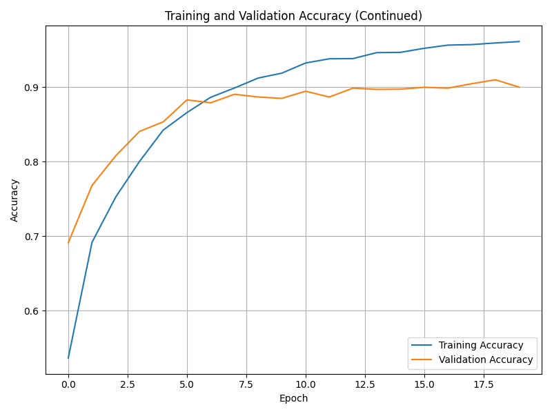
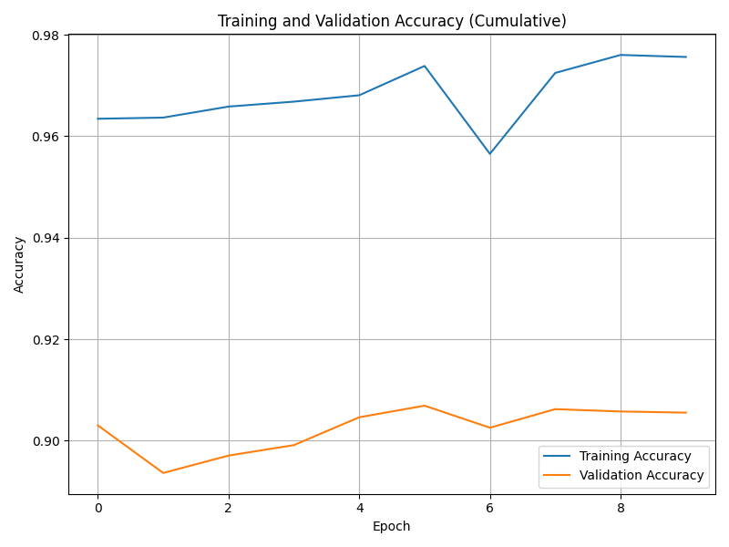
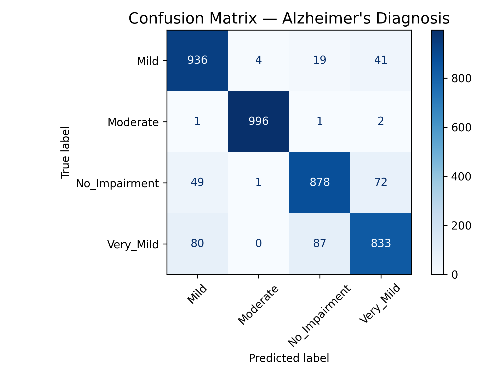
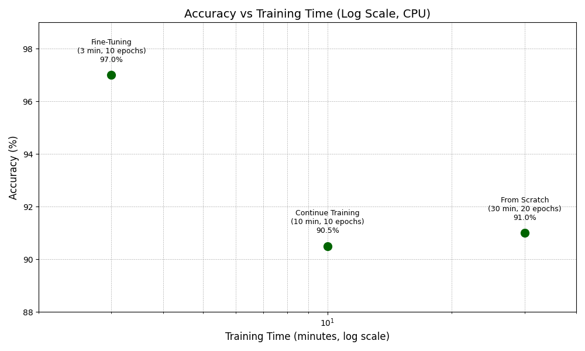

# Alzheimer_AI 🧠

**Alzheimer_AI** is an artificial intelligence model for detecting Alzheimer's disease using blood transcriptomic data. It is trained with machine learning algorithms for high predictive accuracy in early diagnosis.

---

## 🔬 Motivation

Alzheimer's disease (AD) is a complex multifactorial neurodegeneration, currently diagnosed through expensive or invasive methods such as PET scans or cerebrospinal fluid (CSF) biomarkers. There is an urgent need for **non-invasive** and sensitive strategies for early detection. This project proposes a high-performance RNA-based solution for Alzheimer's prediction.

---

## 🚀 Key Features

- Training of classical **machine learning models** (Support Vector Machine, Neural Network, Logistic Regression).
- Feature selection based on **variance filtering** and **PCA**, focusing on genes related to oxidative stress and mitochondrial translation.
- Robust performance evaluation using ROC, Accuracy, F1‑Score, and MCC metrics.

---

## 📈 Results

- **Support Vector Machine**: ROC ≈ 93%, Accuracy ≈ 89%  
- **Neural Network**: ROC ≈ 93%, Accuracy ≈ 86%  
- **Logistic Regression**: ROC ≈ 89%, Accuracy ≈ 89%  

SVM showed the best overall performance across all metrics.

---

## 📦 Dependencies

This project uses the following Python libraries:

- `tensorflow.keras.models` – Deep learning models  
- `pickle` – Model serialization  
- `torch` – PyTorch backend (optional model training)  
- `tkinter` – GUI for model interaction  
- `matplotlib.pyplot` – Visualizations  
- `seaborn` – Statistical plots  
- `sklearn.metrics` – Evaluation metrics (ROC, F1, MCC, etc.)  
- `numpy` – Numerical operations  

Install them via pip:

```bash
pip install numpy matplotlib seaborn scikit-learn tensorflow torch
```
---

## Results

### Accuracy Graph During Training


### Training Accuracy Graph


### Confusion Matrix (Version 1)


### Confusion Matrix After Fine-Tuning


### Training Time or Time Analysis


Thank you for exploring this project! 🚀
